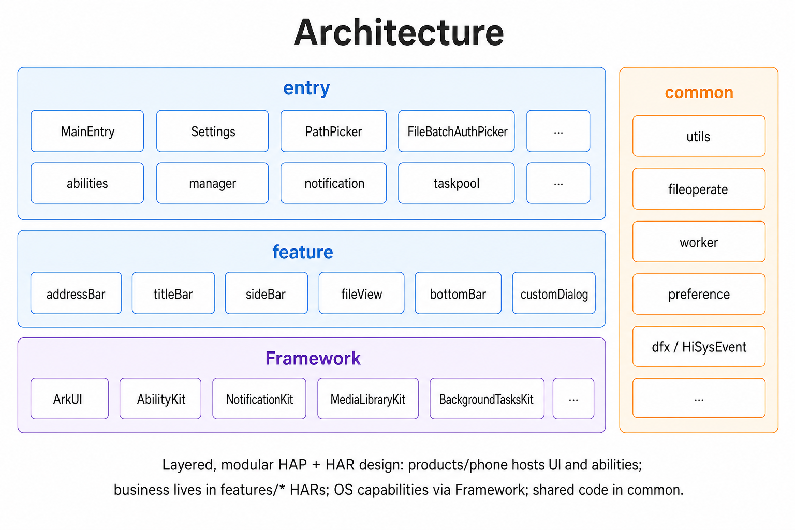

# FileManager

## 简介

FileManager应用是OpenHarmony标准系统中预置的系统应用，为用户提供基础的文件管理功能，包括查看文件，查找文件，
快捷键，文管设置，整理文件。

### 核心功能

1. **存储位置管理**：支持浏览和管理多个存储位置，包括内部存储，外置存储卡（U盘，SD卡），收藏文件夹及最近删除（回收站）；支持文管看图库，快速浏览图片和视频文件。
2. **文件选择器**：提供文件选择器，支持单选/多选文件；支持路径选择器，可自定义保存路径，将文件保存到指定目录。
3. **查看与浏览**：支持宫格视图和列表视图两种展示模式，可自由切换；支持文件排序（按名称/类型/时间/大小）；实况窗实时显示文件操作进度；支持查看文件详情（名称/路径/大小/修改时间等）。
4. **整理文件操作**
   ：提供文件管理操作能力：支持多选，打开，其它应用打开，新建目录，重命名，复制，粘贴，删除（移入最近删除），彻底删除，还原（从最近删除处恢复），移动，收藏/取消收藏；支持打印文件，将图片设为壁纸，将铃声设为铃音；支持清空回收站。
5. **补充功能**：支持搜索当前按目录的文件搜索功能；支持键盘快捷键操作（复制/粘贴）；支持通用设置显示隐藏文件（显示以'.'
   开头的文件和文件夹）。

#### 项目架构



##### 目录结构

```
filemanager
├─ AppScope                              # 应用级配置（app.json5、应用资源）
├─ products                              # 产品工程（应用入口）
│  └─ phone
│     └─ src
│        ├─ main
│        │  ├─ ets
│        │  │  ├─ abilities              # UIAbility
│        │  │  │  ├─ filemanager         # 文管主 Ability
│        │  │  │  ├─ filepicker          # 文件选择器 UIExtAbility
│        │  │  │  ├─ ServiceExtAbility   # 后台服务能力
│        │  │  │  ├─ UIExtAbility.ets
│        │  │  │  └─ OpenMediaUIExtAbility.ets
│        │  │  ├─ application            # AbilityStage
│        │  │  ├─ base                   # 基础
│        │  │  │  ├─ const / constants   # 常量
│        │  │  │  ├─ extension           # 扩展模型
│        │  │  │  ├─ manager             # 业务管理（CopyCutManager / MenuActionHandler / ThumbnailCacheManager 等）
│        │  │  │  ├─ notification        # 系统通知封装（CopyCutNotificationUtil / NotificationUtil）
│        │  │  │  ├─ report              # 埋点 / 上报
│        │  │  │  └─ utils               # 工具方法
│        │  │  ├─ databases              # 数据库 model
│        │  │  ├─ pages                  # 页面（MainEntry / Settings / PathPicker / 选择器 / 预览 / 浏览器等）
│        │  │  └─ taskpool               # TaskPool 任务封装
│        │  └─ resources                 # 字符串、图标、媒体等资源
│        └─ ohosTest                     # OpenHarmony 单元/UI 测试
├─ common                                # 公共 HAR（HmCommon）
│  └─ src/main/ets
│     ├─ animation                       # 动画
│     ├─ config                          # 全局配置
│     ├─ const / constants               # 公共常量
│     ├─ data                            # 数据模型
│     ├─ database                        # 数据库基础能力
│     ├─ dfx                             # 日志 / 埋点（HiLog 等）
│     ├─ dragfile                        # 拖拽
│     ├─ error                           # 错误码
│     ├─ favorite                        # 收藏
│     ├─ fileoperate                     # 文件操作（增删改查/移动/复制）
│     ├─ filesort                        # 排序
│     ├─ gallery / media                 # 多媒体
│     ├─ global                          # GlobalHolder 等全局对象
│     ├─ menu / model                    # 菜单 / 通用模型
│     ├─ pasteboard                      # 剪贴板
│     ├─ preference                      # 持久化
│     ├─ security                        # 加密
│     ├─ share                           # 分享
│     ├─ taskpool                        # 任务池
│     ├─ utils                           # 工具
│     └─ worker / workermanager / workeroperate / workers   # Worker 线程相关（FileOperateWorker 等）
├─ features                              # 业务功能 HAR
│  ├─ addressBar                         # 地址栏
│  ├─ bottomBar                          # 底部操作栏
│  ├─ customDialog                       # 自定义对话框（复制/移动进度、确认、错误等）
│  ├─ fileView                           # 文件列表 / 网格视图
│  ├─ sideBar                            # 侧边栏
│  └─ titleBar                           # 顶部标题栏
├─ open_source                           # 开源声明
├─ sign / signature                      # 签名证书与 profile
├─ build-profile.json5                   # 构建与签名配置
├─ oh-package.json5                      # 工程级依赖
├─ LICENSE
└─ README.md / README_zh.md


```

